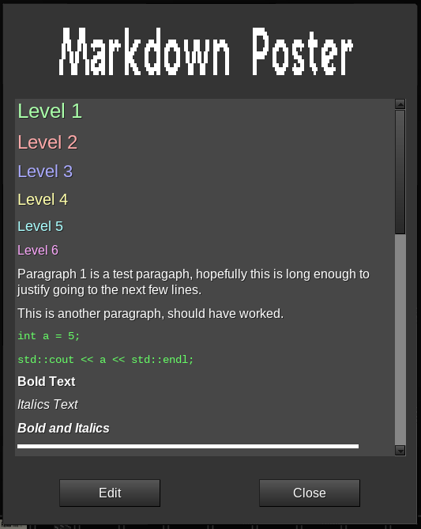

# Markdown Poster

This mod adds a markdown-capable variant to the poster from display modpack.

For more information about display modpack, see the [forum topic](https://forum.minetest.net/viewtopic.php?t=19365) at the Minetest forums.

**Dependencies**: `signs_api`, `markdown2formspec`

**License**: LGPL (code)

## Recipe

Combine a normal poster and a mese crystal.
